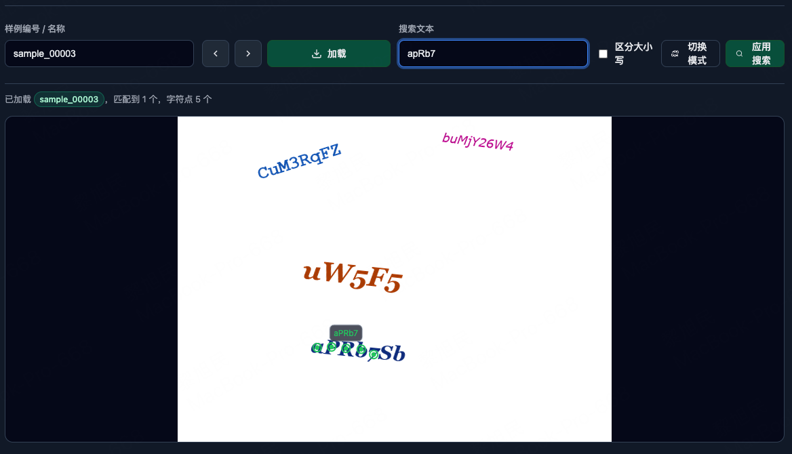

# point-reader

[English](README.md) | [中文说明](README_zh.md)

An algorithmic experiment for text character grounding (visual grounding of text).



## Background
In conventional document understanding, the common pipeline is: layout analysis (content localization) -> recognition. This pipeline can overly constrain recognition logic; even when reading-order prediction is added later, the pipeline is long and the results are not ideal. Line-based recognition also fails to fully exploit textual context. Although multimodal large models alleviate some of these issues, most systems still lack precise fine-grained localization.

Here we reverse the pipeline: recognition -> content localization (localization is not always necessary in real scenarios). We leverage a multimodal model during recognition for better accuracy, and only perform localization when needed. For practicality and controllability, we study content localization as an independent, smaller model.

This project explores the feasibility of the approach. We build a simple dataset and treat content localization as a visual grounding task: given a string or a single character, the model must find its position in the image (center points or detection boxes).

## Problems Addressed
- Enumerating all combinations of strings and substrings is intractable.
- Single-character detection + recognition loses relationships between characters.
- Text-line detection + recognition lacks sufficiently fine-grained localization.

## Data and Tasks
We define three task types:
1. Single-character detection: return a center point and a minimum (oriented) bounding box for the character; this can be treated as a special case of substrings.
2. Multi-character detection: return the center points for each character and a minimum (oriented) bounding box for the substring.
3. Answer-the-character-at-a-given-point: given a point token, predict the character located at that point.

Notes:
- For “points out {text}”, answers use per-character centers from the char_centers field when available, joined by <sep>. Each point is encoded as two tokens: <loc_x><loc_y> in quantized image coordinates.
- For “detect {text}”, answers use oriented bounding boxes (OBB) as 8 tokens (4 points), joined by <sep>. Fallbacks exist when OBB or char_centers are missing.

## Data Optimizations and Negative Samples
- Each image includes multiple strings, and each string is decomposed into individual characters; every character can serve single-character detection.
- Substrings of each string can serve multi-character detection tasks.
- Different strings can contain the same isolated characters or substrings; all answers are sorted by the leftmost x coordinate for consistency.
- Negative samples are constructed so the model can learn to answer “None” when a query doesn’t exist in the image:
  - For detect/points-out: queries for characters/strings not present in the image.
  - For what-text-on-point: points sampled outside any character polygon.
  - Near-string negatives: for each present substring, we generate several similar queries with edit distance 1 (substitution, deletion, insertion, adjacent transposition), ensuring they don’t collide with existing positives or previously added negatives.

## Run
```shell
cd data
# Render synthetic data; you can control the amount inside data_render.py
python data_render.py

# Process data to build QA samples (qa_samples.jsonl)
python process.py

# Train the model
python train.py

# (Optional) Evaluate / Test — coming soon
# python eval.py
# python test.py
```

## Visualize
```shell
# Start a simple HTTP server
python -m http.server 12345

# Open in your browser
# http://localhost:12345/visualize.html
```

## Configuration
- See config.yaml for adjustable parameters.
- You can control data generation parallelism and determinism in data/data_render.py.
- QA construction details (including negative samples and near-string variants) are in data/process.py.

## Expand
Papers and more experiments are in progress. Contributions and discussions are welcome.


> Coding Aided by Gemini-Pro-2.5 & GPT-5
