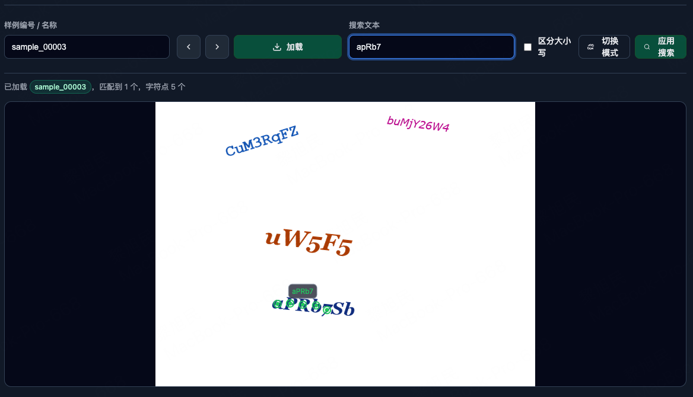

# point-reader

[English](README.md) | [中文说明](README_zh.md)

这是一个文本字符grounding任务的算法实验


# background
文档识别任务中，传统的方法：版面分析（内容定位） -> 识别，这个流程会极大影响识别逻辑，即使后续添加阅读顺序预测，但流程过长且效果并不理想，同时分块识别没能充分利用文本上下文信息。虽然在多模态大模型时代这些问题得到了缓解，但缺少精确定位的能力。
为此我们不妨把流程反过来：识别 -> 内容定位（内容定位在实际场景中并不是刚需的），在识别阶段利用多模态大模型的能力，实现更准确的识别，在需要定位具体内容的时候再进行内容定位。

ps: 当然，内容定位的能力也可以集成在多模态大模型中，只是目前的大部分团队并没有这么做以及细粒度没有那么小，所以暂时使用小一点的模型，把它作为一个独立的任务来研究。

本项目探究思路可行性，为此构建了简单的数据集，把内容定位视作 visual grounding 任务，已知一个字符串或一个字符，要求找到它在图片中位置（中心点或检测框）

解决问题：
- 字符串与子字符串的组合难以定量，无法穷举
- 单字符检测+识别，丢失字符之间的关联关系
- 文本行检测+识别，定位细粒度不够

# Data
任务定义：
1. 单个字符检测（一个中点，最小外接矩形框），特殊的子字符串
2. 多个字符检测（各个字符中点，最小外接矩形框）
3. 回答指定位置的字符

数据优化：
1. 每张图片有很多个字符串，每个字符串都有一个独立的字符，每个字符都可以做单个字符检测
2. 每个字符串的子字符串都可以做多个字符检测任务
3. 不同字符串可能包含相同独立字符或子字符串，它们的顺序按照左上角 x 的大小排序
4. 回答指定位置的字符会构造负样例，即指定图片中没有字符的位置，同理，单个、多个字符检测任务也会创建负样例，当要检测不在图片中的字符的时候，模型能够知道里边没有这个字符或字符串

# Run
```shell
cd data
# 渲染数据，可以控制数量
python data_render.py
# 处理数据，生成指定类型 qa_samples.jsonl
python process.py

screen -S point-reader
python train.py

# 评估模型
python eval.py
# 测试模型
python test.py
```

# Visualize
```shell
python -m http.server 12345
# 打开浏览器，访问 http://localhost:12345/visualize.html
```

# Expand
- 论文和更多实验正在进行中，欢迎一同探讨